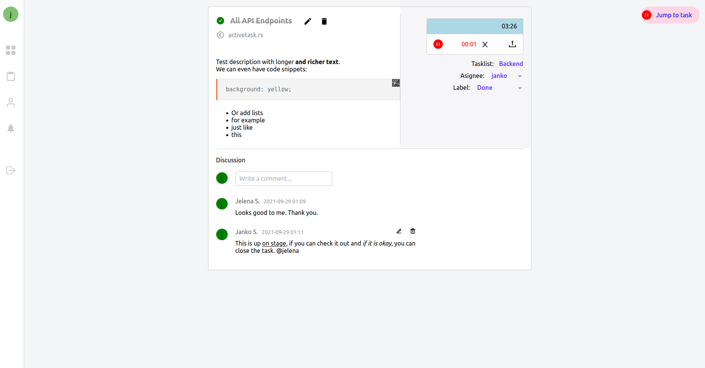

## Live version

## `https://jjsolutions.rs`

Live site can be found on https://jjsolutions.rs 
or scroll down to see the screenshots

Contact me if you want an account at janko@jjsolutions.rs

Scroll down for available scripts

Projects page:

Project detail page:

Task detail page:

Work week page:

Adding a task:

Inviting to project:

Notification page:

My profile page:

## Available Scripts

### `npm install`

To install the required node modules. 

In the project directory, you can run:

### `npm start`

Runs the app in the development mode.\
Open [http://localhost:3000](http://localhost:3000) to view it in the browser.

The page will reload if you make edits.\
You will also see any lint errors in the console.